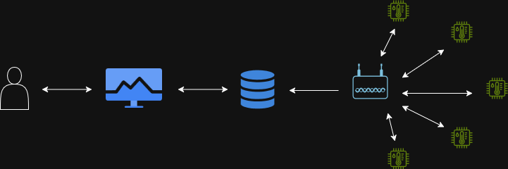
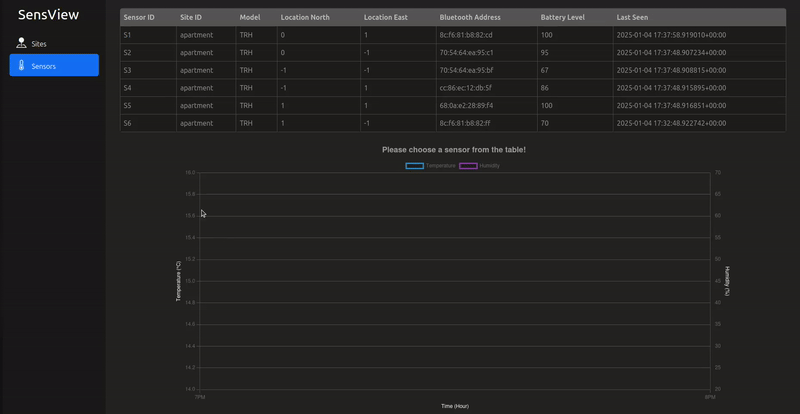

# SensView

SensView is an end-to-end sensor monitoring application. This includes everything from a BLE sensor network to real-time data visualization. This solution was created in order to learn how data collected by embedded systems can be stored and visualized for users. The different components of SensView are described in their respective folders. 

[!NOTE]  
This repo is a copy of a private repo, therefore the commit history is not extensive.

## BLE Sensor Network
The sensor network is made up of one access point (AP) and 6 tags with temperature and relative-humidity (TRH) sensors. Using [Periodic Advertising with Responses](https://novelbits.io/periodic-advertising-with-responses-pawr/) (PAwR), these devices make up a star-network. The role of the network was to collect environmental data periodically. Although the network shown here only consists of 6 nodes, the technology is scalable to 100+ tags.

[More information about the AP](access_point).

[More information about the tags](sensor_tag).

## Processing The Collected data

Once the data was collected and pushed to the [Timescale](https://www.timescale.com/) database, it could basically be used for anything. I wanted to develop some way of visualizing both the sensors and their historical data, so I decided to develop a monitoring platform.
This was my first time doing any sort of front-end development, so I looked at this more from the point of learning than creating something flawless. However, after utilizing [Bootstrap](https://getbootstrap.com/) and having fierce discussions with ChatGPT, I managed to develop something I'm quite happy with:

Currently, the locally hosted web application holds a table of all the sensors, their location, BLE address, battery level, and last-seen status.
By clicking any of the rows, the historical temperature and humidity data of that sensor is shown. The interval of the historical data is configurable in the code.

[Web app source.](web_app)

## Future improvements

Currently, the front-end of this application could be further improved. For example, I've been thinking of a adding a heatmap view for each site, where I could see all the sensor-values at the same time, and detect any interesting zones from the site. 

Also, it would be nice to have a way of adding sensors through the web app. If a new tag is detected by the AP, it could then check if the tag is in the database before adding it to the BLE network.

