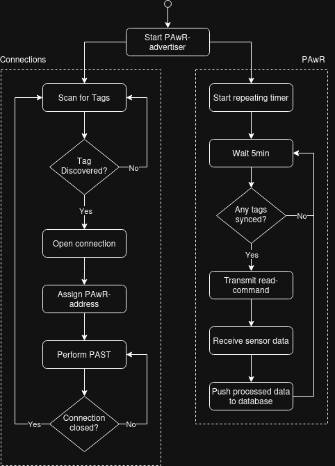

# Access point
For the AP, a [Silabs MG24 radio board](https://www.silabs.com/documents/public/reference-manuals/brd4186c-rm.pdf) was used as a target in [NCP-mode](https://www.silabs.com/documents/public/application-notes/an1259-bt-ncp-mode-sdk-v3x.pdf), together with a Raspberry Pi (RPi) Zero as a host. In this setup, the application is hosted on the RPi and implemented using the [PyBGAPI](https://github.com/SiliconLabs/pybgapi) Python module, while the BLE-stack runs on the MG24 SoC.
The AP orchestrates the whole sensor network and the PAwR communication. It maintains the PAwR-train, keeps track of the status of each tag, and periodically reads and processes data from the tags. Visualized in a flowchart, this means the following:



AS can be seen, the AP can be viewed as having two threads. One thread that scans for advertising tags and adds them to the PAwR-train, and one that maintains the PAwR communication and receives the sensor data.

## Folder structure

```
├── bt_ncp      <- NCP application for the target
├── database
│   ├── db.sql      <- SQL script used to create the database for sensor data
└── host
    ├── app
    │   ├── api
    │   ├── app.py      <- Main script that starts the application
    │   ├── common
    │   ├── config.py   <- Config for database and MQTT connections
    │   ├── DatabaseClient.py
    │   ├── DataProcessor.py
    │   ├── PawrAdvertiser.py   <- Class for managing the BLE communication
    │   ├── SensorTag.py
    │   └── utils
    ├── requirements.txt
```