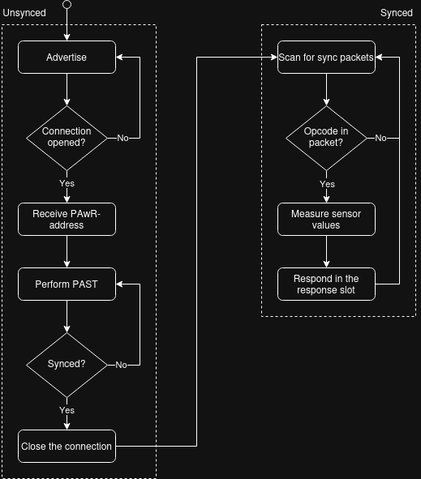
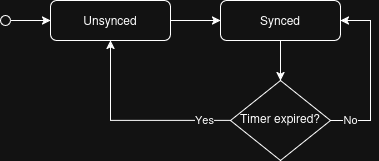

# Sensor Tag
For the tags, [Silabs MG22 radio boards](https://www.silabs.com/documents/public/reference-manuals/brd4182a-rm.pdf) were used with a C-application running on the SoC. The radio boards are connected to battery powered development kits that hold one [Si7021](https://download.mikroe.com/documents/datasheets/Si7021-A20_datasheet.pdf) TRH-sensor.   
The C-application spends the majority of its time in deep sleep, where it consumes ~1.4uA. Depending on the PAwR-interval (I set it to 5s) it will wake up periodically and listen to the sync-packets transmitted by the AP. If the packet contains any pre-defined opcode, the tag will act accordingly and respond to the AP in the tags response slot. Visualized in a flowchart, this means the following:


<!-- There's a 'yes' missing -->

As can be seen, the C-application running on the tags can be divided into two states: *unsynced* and *synced*. The application always starts in the unsynced mode, but spends most of its time in the synced mode. 

### Resyncing a tag
A tag might miss sync packets, leading to a situation where it doesn't receive any opcodes transmitted by the AP. To detect this situation, I've added a timer to the application. This timer restarts every time we receive an opcode, and if the tag does not receive an opcode within x-minutes (configurable), it considers itself out of sync.
This restarts the advertising, giving the AP the chance to resync the tag.



## Folder structure
```
├── app.c   <- Main application source
├── app.h
├── app_libraries
│   ├── inc
│   └── src
│       ├── battery_level.c     <- Driver for reading battery level
│       ├── pawr.c      <- PAwR payload generator
│       └── tag_advertiser.c    <- Functions related to advertising
├── autogen
├── config
├── main.c
├── README.md
├── sensor_tag.Makefile
├── sensor_tag.slcp     <- Project configuration file
├── sensor_tag.slps
└── sl_gatt_service_device_information.c
```